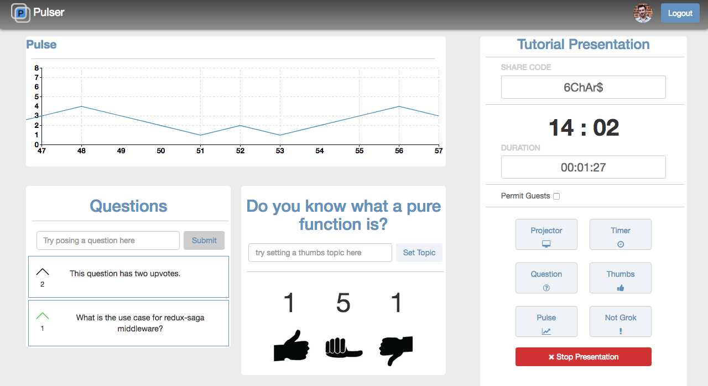

### [**Pulser**](https://pulser-beta.herokuapp.com) -- Give your teacher the thumb!

### Table of Contents

1. [Usage](#usage)
2. [Requirements](#requirements)
3. [Development](#development)
    a. [Installing Dependencies](#installing-dependencies)
    b. [Run the Seed File](#seed-file)
    c. [Setup and Run Server](#setup)
4. [Important Nomenclature](#nomenclature)
5. [Team](#team)
6. [Contributing & Other Documentation](#contributing)

### Usage

Pulser allows the user to assume one of two roles: Presenter or Audience.

#### **Presenter** - Start Your Own Presentation:

 1. At the login page: you will have the choice to login with Github or Google, or proceed as a Guest without logging in. Login with Google or Github; you cannot present as Guest.  
 2. In the upper left corner, click the 'New Presentation' button.  
 3. Your Google Slides from your Google Drive will pop up - select the presentation you wish to give.  
 4. Near the top of the next page, you will see a six digit alphanumeric 'Join Code.'  
 5. Send this code to everyone you want to join the audience.  
 6. In the side panel there are a series of options for the presenter to enable or disable:  

 - **Projector:** This button opens a new tab with your slide deck at full size.   
 - **Questions:** This enables students to type and submit questions, which are displayed for the presenter and the whole class. Questions can be upvoted or downvoted, and are ranked by number of upvotes on your view. Note that this component does not display the question's author, but that data exists in the database, and is given to you in the Summary View  
 - **Thumbs:** Allows you to submit a topic for thumbs. Thumbs are intended to get a general feel from the audience. Audience members can vote up, down, or sideways. A running tally of audience thumbs will be displayed
 - **Pulse:** Displays a running tally of the number of students that have clicked the 'DID NOT GROK' button. This total decrements automatically.   
 - **Feedback:** Displays a 'Feedback' button for Users to click when having difficulty understanding the material. This button updates the running total under 'Pulse', described above.  
 - **Permit Guests:** Determines whether non-logged in users ('Guests') will be allowed to join the presentation.  
 - **Summary:** Displays the Questions asked during the lesson, result of Thumbs polls, and number of times each student has clicked the feedback button.  
- **Stop Presentation:** Ends the presentation, and displays the Summary page.   

#### **Audience:** - View a Presentation:

 1. Log in with Github, Google, or as a Guest.   
 2. Depending on the options enabled by the Presenter, you will have different ways to interact with the Presenter.

### Requirements

Pulser uses the following technologies:  

 - **Server:** Node w/ Express
 - **Database Integration:** Knex/PostgresSQL
 - **Front End Frameworks/Libraries:** React, Redux, JQuery
 - **CSS frameworks:** Bootstrap
 - **Deployment:** Heroku
 - **Continuous Integration:** pre-commit linting and testing hook with Travis

### Development Requirements  
[Heroku CLI](https://devcenter.heroku.com/articles/heroku-cli) required to connect to heroku db from local.  

Command to connect to db via CLI once setup:  
`heroku pg:psql DATABASE_URL --app present-me-beta`

  ## Installing Dependencies

  From within the root directory:
  `npm install`

  ## Run the Seed File
  NOTE: THIS OPERATION WIPES THE DATABASE. USE WITH CAUTION. THIS MEANS YOU!!!

  Pulser comes with dummy data located in the /seeds directory
  To load this data into the database, type:
  `knex seed:run`

  This command will wipe the existing database and reload it with dummy data. Note that if you add mutliple seed files, Knex will execute them in alphabetical order.

  ## Setup and Run Server
  1. `npm run db_setup` (Only need to do this the first time in a given terminal session.)
  2. `npm run build`
  3. `npm start`

### Important Nomenclature  

 - **Lecture:**  A specific instance in which a presenter is giving a presentation.  
 - **Presentation:**  A set of Google slides.  
 - **lectureId:**  ID assigned in database to lecture.  
 - **presentationId:**  The ID provided by Google Slides API for slides.  

### Team  

  - __Product Owner__: Ross Topol  
  - __Scrum Master__: Johnny McDuff  
  - __Development Team Members__: Christian Aquino, Ari L. Frankel, Sheel Bedi  

###  Usage and Bugs
Google presentation must be shareable with a URL. Adjust sharing settings for your presentation in your Google Drive.

### Contributing and Other Documentation
Database schema at databaseschema.png, located in the root directory of this repo.

See [CONTRIBUTING.md](CONTRIBUTING.md) for contribution guidelines.
